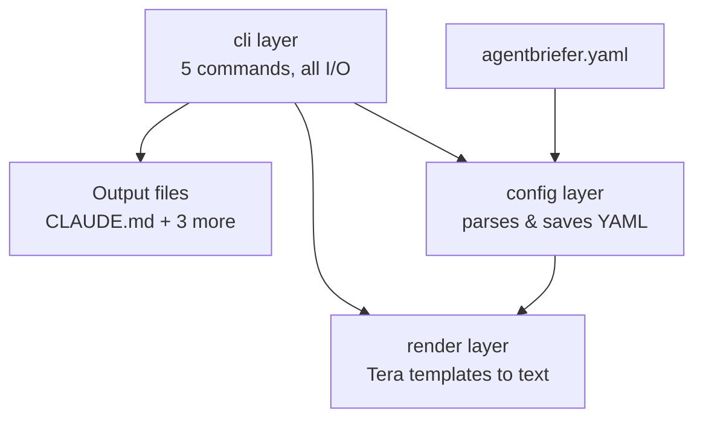

# Agentbriefer CLI

[](https://github.com/dexterhere/agentbriefer/actions/workflows/ci.yml)

Configure how AI coding agents think, code, test, and stop inside your project.

Agentbriefer CLI is a command-line tool for configuring AI coding-agent behavior
inside software projects. Instead of repeatedly telling an AI assistant how to
work, you configure the rules once. Agentbriefer then generates the instruction
files different AI coding tools understand — `CLAUDE.md`, `AGENTS.md`, Cursor
rules, and Copilot instructions — from a single source of truth.

This is a personal tool first: the goal is to make day-to-day agentic
development easier and more consistent, not to chase every AI tool that
exists.

## Status

v1 is complete and working: `init`, `generate`, `sync`, `profile`, and
`doctor` are all implemented, tested, and colorized. See
[Roadmap](#roadmap--whats-next) for what's being considered beyond v1.

## Installation

Not yet published to crates.io — build from source:

```bash
git clone https://github.com/dexterhere/agentbriefer.git
cd agentbriefer/agentbriefer
cargo install --path .
```

This installs a `agentbriefer` binary (via `cargo`'s bin directory, usually
`~/.cargo/bin`) — make sure that's on your `PATH`. Everything below assumes
you're running `agentbriefer` from inside the project you want to configure.

## Quick start

```bash
cd your-project
agentbriefer init        # interactive wizard -> writes agentbriefer.yaml
agentbriefer generate    # writes CLAUDE.md, AGENTS.md, .cursor/rules/agentbriefer.mdc,
                        # and .github/copilot-instructions.md
```

Once you've hand-edited a generated file (added your own notes, tweaked
something), switch to `sync` instead of `generate` so those edits survive:

```bash
agentbriefer sync         # re-renders but preserves manual edits outside
                         # the <!-- agentbriefer:managed:start/end --> markers
agentbriefer doctor        # flags conflicting settings, missing fields, and
                          # files that have drifted from the current config
```

## Core idea

Agentbriefer is not only about telling AI what to write. It's also about
teaching it when *not* to write code, when to reuse existing code, when to
ask before a risky change, and when to stop once the requested work is done.

### The problem

AI coding agents behave inconsistently — clean and minimal one day,
over-engineered the next. Common failure modes: writing too much code,
touching unrelated files, adding unnecessary dependencies, ignoring existing
architecture, removing validation/error handling, and continuing past the
requested scope.

### The philosophy — adaptive decision loop

Before writing code, the agent should be guided to ask itself:

- Is code actually needed for this request?
- Can this be solved by explaining, configuring, or documenting instead?
- Can existing code be reused?
- Can the standard library / native platform feature solve this?
- Is a new function / abstraction / dependency really necessary?
- What is the smallest safe change?
- Does the change match the configured style?
- Does it preserve security, validation, tests, and existing behavior?
- Should the agent stop and ask before continuing?

## Commands

| Command | Purpose |
|---|---|
| `agentbriefer init` | Interactive wizard; writes the project's `agentbriefer.yaml`. Colorized prompts, a one-line explanation before each question, and a review screen at the end where you can jump back and change any earlier answer before saving. |
| `agentbriefer generate` | Renders every configured output format and writes it. A blunt overwrite — no attempt to preserve manual edits. Reports success/failure per format rather than failing the whole run. |
| `agentbriefer sync` | Re-renders configured outputs but wraps Agentbriefer's content in `<!-- agentbriefer:managed:start/end -->` markers, so anything you add outside them survives. See [Generate vs. sync](#generate-vs-sync). |
| `agentbriefer doctor` | Read-only linter: flags conflicting settings (e.g. `dependency_policy: allow` with `security_level: strict`), missing required fields, and files that would change if you ran `sync` right now. |
| `agentbriefer profile list` / `create` / `switch` | Save a developer style (style + explanation style) once, reuse it across projects/stacks without re-answering the same two questions in every `init`. See [Developer profiles](#developer-profiles). |

## Generate vs. sync

`generate` and `sync` render the same content; they differ in what happens
to a file that already exists:

- **`generate`** always fully overwrites. Simplest mental model, right for
  the very first run.
- **`sync`** only replaces what's between its own markers. Cursor's `.mdc`
  frontmatter (which must be the literal first bytes of the file) is kept
  above the managed block for the same reason — so Cursor can still parse
  it after a sync.

**Known tradeoff:** if you `sync` a file (adding your own notes outside the
markers) and later run `generate` on it out of habit, those manual
additions are lost — `generate` has no concept of markers, by design. Once
you've started hand-editing a generated file, stick to `sync`.

## Developer profiles

A *developer profile* is just your working style (developer style +
explanation style) — the two questions that don't change based on which
project or stack you're in. Save one once:

```bash
agentbriefer profile create   # asks the two questions, saves under
                             # ~/.config/agentbriefer/profiles/<name>.yaml
agentbriefer profile list
agentbriefer profile switch   # applies a saved profile's style to the
                             # CURRENT project's agentbriefer.yaml
```

`init` also offers to pre-fill from a saved profile instead of asking again.
Profiles are a pre-fill source, not a live link: editing a saved profile
later doesn't retroactively change projects that already used it.

## Configurable areas

- **Developer style** — minimal, practical, learning-focused, enterprise, security-first
- **Project type** — backend API, frontend app, CLI tool, full-stack app, library, docs-heavy
- **Programming stack** — language, framework, database, testing tools, package manager
- **Security level** — basic, standard, strict
- **Testing level** — light, practical, strict
- **Dependency policy** — allow, explain-first, ask-first
- **Architecture style** — simple, simple-layered, feature-based, advanced
- **Explanation style** — short, beginner-friendly, detailed, tradeoff-based
- **Stop rules** — free-form situations where the agent must stop, ask, or avoid continuing

## Generated output

| Format | Written to |
|---|---|
| Claude Code | `CLAUDE.md` |
| AGENTS.md convention | `AGENTS.md` |
| Cursor | `.cursor/rules/agentbriefer.mdc` (with the `description`/`alwaysApply` frontmatter Cursor expects) |
| GitHub Copilot | `.github/copilot-instructions.md` (the real path Copilot reads repo-wide custom instructions from) |

All four are generated from the same config through four shared template
partials (`config_summary`, `decision_loop`, `workflow_loops`, `stop_rules`)
— the philosophy text has one source of truth instead of four copies that
could drift apart.

## Workflow loops

- **Feature Loop** — understand the request, check existing code, plan the smallest safe change, implement, verify, stop.
- **Bug Fix Loop** — find the root cause, avoid broad refactors, smallest fix, regression test when practical, verify.
- **Security Loop** — treat auth, validation, secrets, permissions, and DB changes as high-risk; preserve safety checks; require explanation.
- **Refactor Loop** — only refactor when requested; preserve behavior; don't mix with feature work.
- **Testing Loop** — add/update tests per configured testing level; explain how to run them.
- **Documentation Loop** — update docs only when setup, commands, env vars, or behavior actually change.

## Architecture

Three layers, each only depending on the one "below" it: `config` (data
model + YAML I/O), `render` (Tera templates → text), and `cli` (commands,
prompts, and all real filesystem/environment access).



See **[docs/ARCHITECTURE.md](docs/ARCHITECTURE.md)** for what each layer
owns, the templates/partials layout, and a walkthrough of exactly what
happens inside `init`, `generate`, `sync`, `doctor`, and `profile`.

## Tech stack

Built in Rust:

- `clap` — CLI argument/subcommand parsing
- `dialoguer` — interactive prompts, themed with `ColorfulTheme`
- `serde` / `serde_yaml` — `agentbriefer.yaml` and profile (de)serialization
- `strum` — enum iteration + `Display` for prompt option lists, kept in
  sync with `serde`'s kebab-case YAML representation
- `tera` — Jinja2-style templating for conditional instruction content
- `rust-embed` — bundles `templates/` into release binaries, reads from disk in debug builds so template content can be edited without recompiling
- `thiserror` — typed errors in `config`/`render` (`ConfigError`, `RenderError`)
- `anyhow` — error handling at the CLI boundary
- `directories` — cross-platform resolution of `~/.config/agentbriefer`
- `owo-colors` — terminal color for prompts and status output
- `figlet-rs` — the startup banner
- `insta` / `tempfile` (dev) — snapshot tests for rendered templates and filesystem-based integration tests

## Security

See [SECURITY.md](SECURITY.md) for how to report a vulnerability.

## License

Licensed under either of [Apache License, Version 2.0](LICENSE-APACHE) or
[MIT license](LICENSE-MIT) at your option (the standard Rust ecosystem
convention).

## Roadmap / what's next

Being considered beyond v1 (not yet built):

- **More providers** — additional output formats (Windsurf, Continue.dev,
  Aider, ...) beyond the current four. Cheap to add given the template/
  partial architecture above.
- **Language/stack detection** — auto-detect language, package manager, and
  framework from `Cargo.toml`/`package.json`/etc. during `init`, pre-filling
  the prompts instead of starting blank.
- **Skill marketplace (v0)** — `profile search`/`install` against a curated
  Git-repo index of shared developer profiles, reusing the existing
  `~/.config/agentbriefer/profiles/` machinery. No server, no accounts.

Explicitly out of scope for now: web dashboard, cloud sync, team billing,
VS Code extension, full autonomous agent runner, automatic PR creation,
complex memory system, enterprise policy management.
