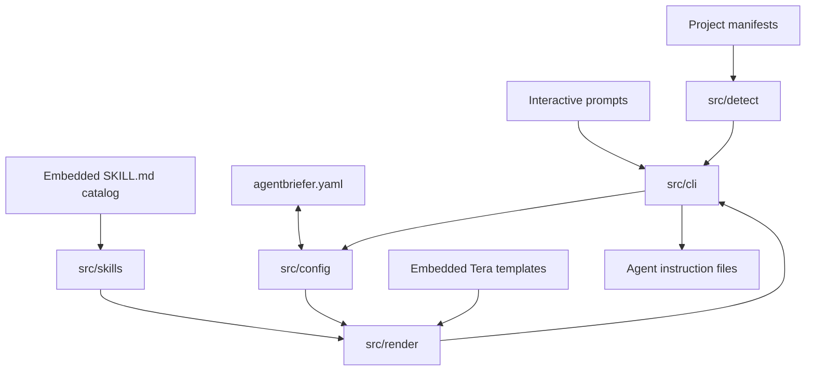

# Architecture

Agentbriefer is a Rust CLI organized around pure configuration, detection, rendering, and skill
components, with the `cli` module owning interactive behavior and real filesystem operations.

## Modules

### `config`

Defines the typed YAML schema and generic load/save operations. It turns a path into a validated
Rust value or serializes a value back to YAML. Project location and prompting remain outside it.

### `detect`

Contains one detector per supported ecosystem plus shared dependency categorization. Detection reads
manifest evidence from the current directory and returns an optional `DetectedStack`; it does not
write configuration.

### `skills`

Loads `skills/**/SKILL.md` through `rust-embed`, parses YAML frontmatter and Markdown bodies, validates
directory/ID agreement, sorts the catalog, and provides role and stack recommendation queries.

### `render`

Registers embedded Tera templates once, serializes configuration and resolved skills into a rendering
context, and returns text for an `OutputFormat`. It does not choose destinations or write files.

### `cli`

Owns clap dispatch, prompts, terminal presentation, current-directory resolution, per-user profile
paths, materialized skills, and output writes. Command modules compose the pure components and report
partial per-format failures.

### `textutil`

Provides shared frontmatter splitting used by skill parsing and synchronized Cursor output handling.

## Embedded assets

`templates/` and `skills/` are read directly in debug builds and embedded into release binaries. A
released executable therefore needs no runtime template or catalog directory.

## Write models

- `generate` renders and replaces every selected output.
- `sync` preserves text outside line-delimited managed markers.
- skill commands materialize catalog entries under `.agentbriefer/skills/` and synchronize outputs.
- developer profiles and skill profiles use platform-standard per-user configuration directories.

The repository-level [architecture note](https://github.com/dexterhere/agentbriefer/blob/main/docs/ARCHITECTURE.md)
is maintained alongside this page for contributors browsing the source tree.

