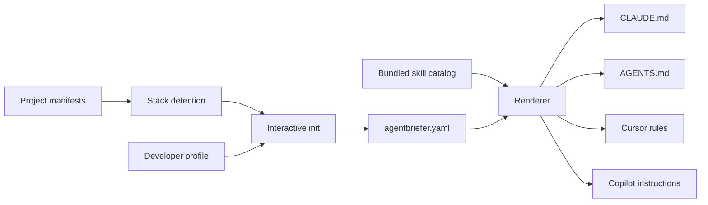

# How Agentbriefer works

Agentbriefer separates project policy from the syntax expected by individual AI
tools.



## 1. Initialize the project

Run `agentbriefer init` from the repository root. Agentbriefer inspects supported
manifest files, uses the result as editable prompt defaults, and asks about the
project and your preferred agent behavior.

The wizard writes `agentbriefer.yaml`. Detection is a convenience, not an
uneditable verdict.

## 2. Keep policy in YAML

The configuration stores structured choices such as developer style, testing
level, dependency policy, architecture style, outputs, stop rules, and installed
skill IDs. It does not copy generated skill content into YAML.

```yaml title="agentbriefer.yaml"
developer:
  style: practical
  explanation_style: short
project:
  project_type: cli-tool
  stack:
    language: rust
    package_manager: cargo
  security_level: standard
  testing_level: practical
  dependency_policy: explain-first
  architecture_style: simple
skills:
  - no-secrets-in-repo
stop_rules:
  - Stop before changing the release workflow.
```

## 3. Render tool-specific files

`generate` and `sync` load the same configuration and render the same shared
instruction content through Tera templates. Each output adds only the wrapper
needed by its target tool.

| Tool or convention | Output path |
|---|---|
| Claude Code | `CLAUDE.md` |
| AGENTS.md consumers | `AGENTS.md` |
| Cursor | `.cursor/rules/agentbriefer.mdc` |
| GitHub Copilot | `.github/copilot-instructions.md` |

## 4. Resolve skills at render time

Skills ship inside the Agentbriefer binary. The configuration stores their IDs;
the renderer resolves those IDs against the current bundled catalog and inlines
the instruction body into every configured output.

Adding a skill also materializes a readable copy at
`.agentbriefer/skills/<id>/SKILL.md`. That copy is generated and should not be
hand-edited.

## 5. Check drift

`agentbriefer doctor` compares configured outputs with a fresh render. It also
checks policy conflicts, required fields, and skill IDs missing from the local
catalog.

:::note

Doctor reports findings but currently exits successfully. Treat it as a
diagnostic report, not as a failing CI quality gate.

:::
