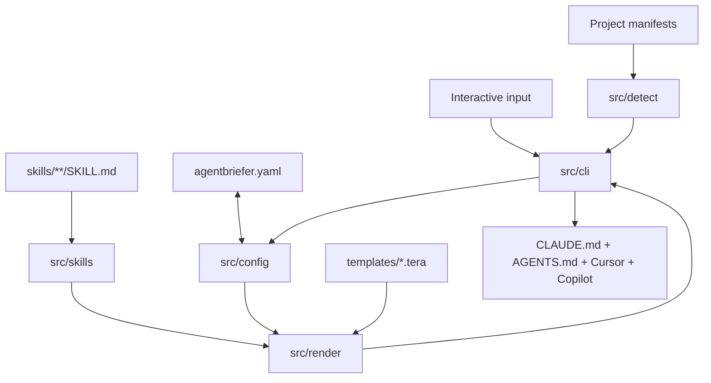

# Architecture

Agentbriefer is a Rust CLI that turns typed project policy and embedded skills into native AI-agent
instruction files. Pure subsystems return data or text; the CLI layer owns prompting and real writes.

## Subsystems

### `src/config`

Defines `AgentbrieferConfig`, developer and project profiles, stack context, policy enums, and output
formats. Its loader serializes typed data to and from YAML paths. It does not prompt or decide where
a project lives.

### `src/detect`

Contains 28 ecosystem detectors. Each reads a root-level manifest and returns a `DetectedStack` with
language, framework, database, package manager, testing tools, and key dependencies when reliable.
Detection is ordered, non-recursive, read-only, and tolerant of malformed manifests.

### `src/skills`

Uses `rust-embed` to load `skills/**/SKILL.md`. The registry parses frontmatter and body, validates
that each declared ID matches its directory, sorts skills by ID, and supports role and detected-stack
queries. An empty `compatible_stacks` list means stack-agnostic.

### `src/render`

Registers embedded Tera templates once and renders a selected `OutputFormat` from serialized config
plus resolved skills. Shared partials keep the decision loop, workflow loops, stop rules, and project
summary aligned across output wrappers.

### `src/cli`

Owns clap dispatch, dialoguer prompts, terminal UI, current-directory lookup, platform user-data
paths, and all project writes. Command modules compose the pure subsystems:

- `init` detects context and writes `agentbriefer.yaml` after interactive review;
- `generate` fully replaces configured outputs and reports success per format;
- `sync` replaces only line-delimited managed blocks, keeping Cursor frontmatter first;
- `doctor` reports conflicts, missing values, unknown skills, missing files, and render drift;
- `profile` stores personal developer preference snapshots;
- `skill` manages bundled skill IDs, generated local copies, and reusable skill-set snapshots.

### `src/textutil.rs`

Holds shared frontmatter splitting used by embedded skills and Cursor synchronization.

## Embedded and local data

`rust-embed` reads `templates/` and `skills/` directly in debug builds and packages them into release
binaries. A release therefore has no runtime asset dependency.

Installed project skills are generated under `.agentbriefer/skills/<id>/SKILL.md`. Developer profiles
and skill profiles live in the platform-standard per-user configuration directory resolved by the
`directories` crate. Both profile types are copied snapshots, not live inheritance.

## Safety boundaries

- `generate` is intentionally a full overwrite; `sync` is the preservation path.
- Managed markers are recognized only as standalone lines.
- Final output paths that are symbolic links are refused.
- Unknown skill IDs are reported by `doctor` and skipped during materialization/render resolution.
- A failure in one output format is reported without preventing other formats from being written.

## Tests

Module unit tests cover schemas, detectors, parsing, marker logic, and filesystem helpers.
`tests/cli_integration.rs` exercises compiled CLI workflows, while `insta` snapshots protect rendered
output. CI runs formatting, Clippy with warnings denied, and the full Rust test suite.

The versioned contributor documentation contains the companion
[architecture guide](https://docsagentbriefer.vercel.app/docs/contributing/architecture).
