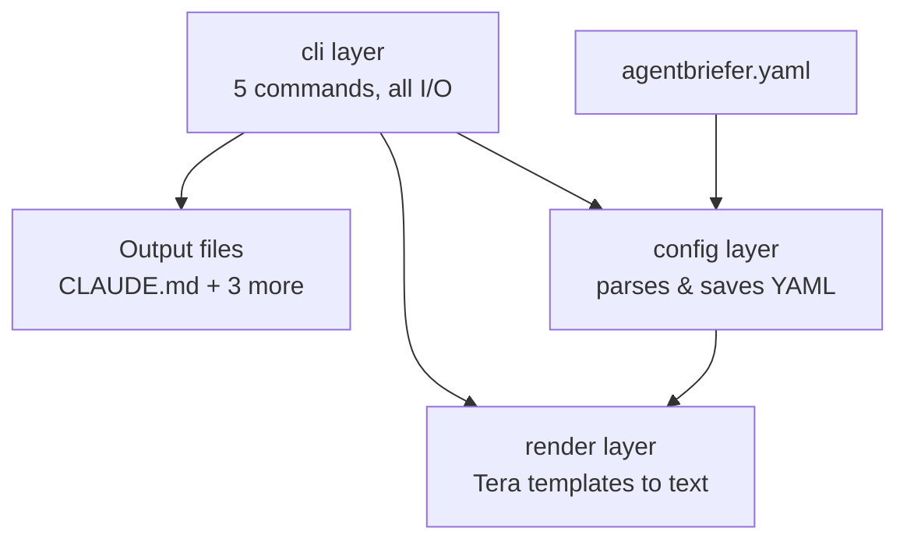

# Architecture

Agentbriefer CLI is split into three layers. Each layer only depends on the
one "below" it — this is enforced by convention, not by a build tool, but
it's consistent throughout the codebase:



## The three layers

### `config` — data model + YAML I/O

`src/config/` (`schema.rs`, `loader.rs`, `error.rs`). Defines
`AgentbrieferConfig`, `DeveloperProfile`, `ProjectProfile`, `Stack`, and the
seven config enums, all deriving `serde::{Serialize, Deserialize}` and
`strum::{Display, EnumIter}`. `loader::load`/`loader::save` are generic over
any serializable type — the same two functions read/write both
`agentbriefer.yaml` and the profile files under `~/.config/agentbriefer/profiles/`.

This layer has **no dependency on the filesystem location, the terminal, or
templates.** It only knows how to turn a `Path` into a typed value and back.
That's what makes it fully unit-testable without a tempdir workaround for
every test — see `config::loader`'s tests for the pattern.

### `render` — turns a config into text

`src/render/` (`engine.rs`, `error.rs`). `Renderer::new()` registers every
`.tera` file (via `rust-embed`) into one `tera::Tera` instance — done once,
reused across every render call, since parsing templates is real work.
`Renderer::render_output(format, config)` builds a `tera::Context` straight
from the config via `Context::from_serialize` (works for free because every
config type already derives `Serialize`) and renders the template that
`OutputFormat::template_name()` maps to.

This layer depends on `config` (it renders a `AgentbrieferConfig`), but knows
nothing about *where* that config came from or where the rendered text will
be written.

### `cli` — commands, prompts, and all real I/O

`src/cli/` — one file per command (`init.rs`, `generate.rs`, `sync.rs`,
`doctor.rs`, `profile.rs`), plus two shared helpers (`prompt.rs` for the
enum-picker prompt, `ui.rs` for color/hints/the banner). This is the
**only** layer that touches `std::env::current_dir()`, stdin, or
`~/.config` — every command resolves those for real, then calls into
`config`/`render` with plain, injectable `Path`/`AgentbrieferConfig` values so
the interesting logic stays testable against a tempdir instead of the real
filesystem.

## Templates

```
templates/
├── partials/                  shared across all four output formats
│   ├── config_summary.tera    developer/project profile display
│   ├── decision_loop.tera     the adaptive decision-loop questions
│   ├── workflow_loops.tera    the six workflow loops
│   └── stop_rules.tera        configured stop rules (with a sensible default)
├── claude.md.tera
├── agents.md.tera
├── cursor_rules.tera
└── copilot_instructions.tera
```

Every top-level template is just a format-specific header (and, for Cursor,
YAML frontmatter) plus four ``s. The philosophy text — the
decision loop, the workflow loops — exists exactly once, so it can't drift
into four slightly-different copies over time.

`rust-embed` reads `templates/` straight off disk on every call in debug
builds (edit content, no recompile) and bakes the files into the binary at
compile time in release builds — no feature flags needed for either
behavior, it's the crate's default.

## How each command actually flows

**`init`** — the only command that doesn't touch `render` at all. Walks
the config questions (optionally pre-filling the developer style from a
saved profile), shows a review-and-edit menu built from the config's
current values, then calls `config::save`.

**`generate`** — `config::load` the project's `agentbriefer.yaml`, build one
`Renderer`, and for each configured output: render it, and on success write
it to its real path (creating parent directories like `.cursor/rules/` as
needed). A rendering failure for one format (e.g. a template that doesn't
exist yet) is recorded and reported, not treated as fatal — the other
formats still get written.

**`sync`** — the same render pass as `generate`, but the write step is
different: it splits the rendered output into `(frontmatter, body)`
(frontmatter must stay the literal first bytes of a file for Cursor's
`.mdc` parser to work), wraps `body` in
`<!-- agentbriefer:managed:start/end -->` markers, and — if the file already
has those markers — replaces only the byte range between them, leaving
everything else in the file untouched.

**`doctor`** — read-only. Checks the config directly for conflicting
settings (e.g. `dependency_policy: allow` with `security_level: strict`)
and missing fields, then for each configured output: is the file missing
entirely, or does a fresh render disagree with what's on disk? The second
check reuses `sync`'s own marker-parsing helpers rather than inventing a
separate staleness mechanism — "out of sync" concretely means "running
`sync` right now would change this file."

**`profile`** — `list`/`create`/`switch` operate on
`~/.config/agentbriefer/profiles/*.yaml`, resolved via the `directories`
crate. A profile is just a saved `DeveloperProfile` (two fields); `switch`
loads one and overwrites the *current* project's `developer:` section.
Profiles are a pre-fill/copy source, not a live reference — editing a saved
profile later doesn't retroactively change projects that already used it.
